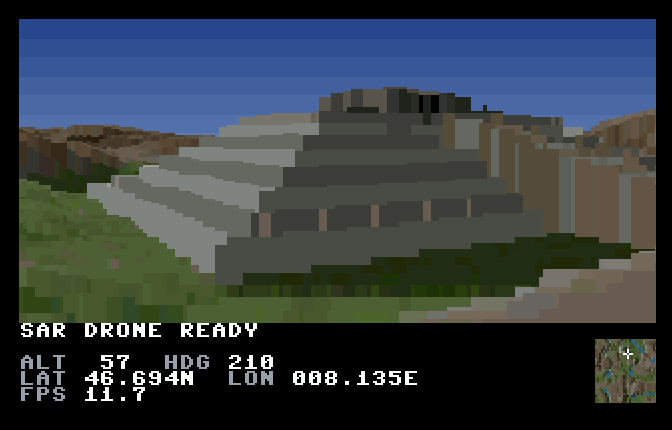
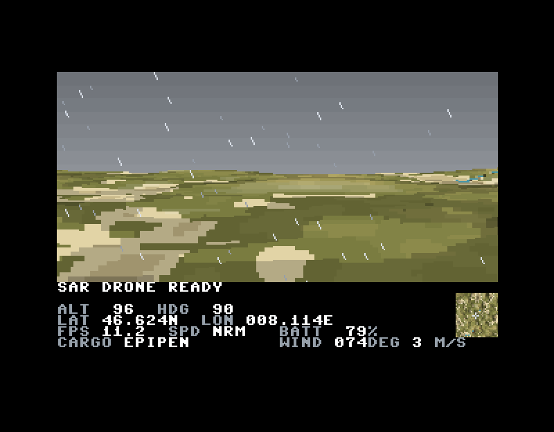

# Search and Rescue

A 1990s-style heightfield voxel flight simulator for the [MEGA65](https://mega65.org/),
written in C for the [Calypsi](https://github.com/hth313/Calypsi-tool-chains) toolchain,
with the renderer's inner loop in 45GS02 assembly.



The eventual game is a post-earthquake drone search-and-rescue simulator: low-altitude
flight over broken terrain, thermal and acoustic sensor modes, payload drops, and
aftershocks that reshape the landscape mid-flight. `documentation/vision.md` has the full design.

## Status

Two missions exist, end to end: a title screen, a mission list, a briefing, a
flight, and a debrief. They are deliberately the same flight with different
words on it — fly to somebody and press a key — because that is where the
engine is: **The Lost Hiker** wants a report filed on a hiker waving from a
pyramid on an island, and **First Aid** wants an EpiPen dropped to a pair of
hikers by a lake out on the plains, with only one EpiPen aboard and a failed
mission if it goes down in the wrong place. The two fly over **different
generated worlds, both on the one disk**.

- 320x152 full-colour 3D view, double buffered, over a six-row 40-column text panel
- 512x512 height and colour maps, exomizer-crunched on the disk and
  unpacked into attic RAM at boot — two of them, one per mission, resident at
  once and switched between for 512 bytes of table
- Front-to-back ray march with a y-buffer, fixed point throughout, inner loop in
  assembly. It marches 160 rays and each fills the two pixels it owns, which keeps
  the panel's characters a readable 8 pixels wide without paying for twice the march
- About 12.5 frames per second at the default map sizes, up from 0.74 when the
  renderer was all C; a real MEGA65 runs a few percent slower than the emulator
- Altitude, heading, GPS coordinates and frame rate in the panel, with an overview
  map of the whole world and a crosshair showing where you are
- **Two missions over two different worlds, both on the one disk** — the first
  over a temperate island, the second over hot plains in the rain. Both are
  generated from a paragraph of YAML and resident in attic RAM at once, which
  a hand-drawn map pair could never be: two generated maps come to 186 KB
  crunched against 661 KB for one drawn one, leaving room on the disk for
  several more
- Two software billboards — a lost hiker waving from the step pyramid on the
  island's northern headland at 46.687N 8.106E, and a casualty and their
  friend on the lake shore at 46.658N 8.149E — drawn over the finished terrain: scaled by distance, and clipped
  against the heightfield with the same y-buffer the ray march already keeps, so
  a ridge in front of them hides their feet
- Drone controls modelled on a real one: yaw, climb, camera gimbal and a
  three-position speed limiter (see Controls below)
- A wind, randomised at launch and veering every few seconds, that blows the
  drone about whatever it is doing — including a hover. The panel names it the
  way a weather report does, by the direction it comes from
- A battery that runs down as you fly, four minutes or so at normal speed and
  a quarter of that in sport. Run it flat and the mission is over
- **A three voice SID tune** over the loading screen, the title and the
  mission list, played from the ROM's own interrupt at 50 Hz and written in
  both stereo SIDs. It stops at the briefing and stays off for the flight: a
  search is meant to sound like the wind and the rain
- Weather per mission: mission two flies under an overcast sky with rain drawn
  over the finished picture, leaning as it falls. It costs 0.68 ms a frame,
  because the sky is sixteen palette entries rather than any pixels at all
- **Boots in about ten seconds** in the emulator, twelve off SD and 25 off a
  floppy, nearly all of it reading the two maps. The loading screen is the
  title screen — same black, same white, same words in the same place — with
  LOADING and a progress bar where PRESS SPACE will be, so the machine can be
  seen to be alive and the boot is one picture from the first second to the
  menu

**The maps are generated rather than drawn, and that is what puts two of them
on the disk.** `tools/genmap.py` turns a short YAML description — island or mountains
or flatlands, a climate, how many rivers and lakes and hills, how rugged, at
what scale — into the same height/colour PNG pair the converter already reads,
reproducibly from a seed. The terrain is **lit by a sun in the west**, the way
the hand-drawn map is, which is what makes a heightfield read as country rather
than as a coloured contour map: the land ramp is 21 elevation steps of six
shades each, and which shade a pixel gets is how fast the ground falls towards
the light. Landmarks are terrain too: a `pyramid` in the mission's `items` is
terraformed into both maps, terrace by terrace, and costs the renderer nothing
because there is nothing there but ground. Switching worlds between missions
costs 512 bytes of table: a map's whole location lives in the renderer's plane
lookups, so pointing the march at another one is rebuilding those and nothing
else. And the arithmetic is the MEGA65's own — Q0.16 integers, reciprocals,
tables, histograms instead of sorts, which is what makes a seed reproduce a map
byte for byte — and what let `tools/checkview.py` prove the PC previewer and
the MEGA65 draw the same picture pixel for pixel.

**Running that generator on the MEGA65 itself was tried, and it is not worth
it.** The whole pipeline was ported — eleven passes, every one byte-identical
to the Python, the per-pixel work in 45GS02 assembly, 64 seconds a map. But
that is a 512x512 pipeline and the game ships a 1024x1024 colourmap, which is
four times the work at every pass: about 255 seconds a map, against 66 to load
both maps off a floppy and 31 off SD. The code is on the `mega65-mapgen` branch
and `documentation/on-device-maps-experiment.md` is the write-up, with the
arithmetic at the top. The maps are generated on the PC, which is where they
were always generated — and the boot is about ten seconds in the emulator, 14
off SD and 27 off a floppy.

`tools/preview.py` flies one on the PC **with the game's own
renderer** — the same march, projection, map sampling and flight model, at the
same 12.5 frames a second, with the constants read out of `src/` rather than
copied — so terrain can be judged from the air and item coordinates noted down
by flying to them. At the same camera it draws the machine's picture exactly,
and `tools/checkview.py` is that comparison as a four-second command to run
after touching the renderer. `maps/` holds the shared palette and the missions' own map files;
`documentation/procedural-maps.md` has the design and what is built so far.

Getting there meant building a profiler first (`src/profile.c`, read with
`tools/profread.py`) rather than guessing. The compiler's 32-bit multiply turned out
to be 64% of the frame at 2203 cycles a go, against 85 on the hardware multiplier.
See `todo.md` for what is next.



*Mission two, over `maps/plains.yaml` — hot, flat country in the rain, with a
lake on the horizon. The disk carries this and the island both. The two shots
above it are of the hand-drawn map the engine was built against, which is no
longer what ships.*

## Building

You will need:

- [Calypsi 6502 tools](https://github.com/hth313/Calypsi-tool-chains/releases) 5.18 or later
- [Xemu](https://github.com/lgblgblgb/xemu) for `xemu-xmega65`
- Ruby, for the bundled `tools/diskutil.rb`
- Python with Pillow and NumPy, for the map converter and the generator.
  `tools/preview.py` also wants tkinter (`python3-tkinter` on Fedora,
  `python3-tk` on Debian) and PyYAML
- [exomizer](https://bitbucket.org/magli143/exomizer/wiki/Home), which crunches the
  maps so they fit a D81. `tools/convmap.py` looks for it in `$EXOMIZER`, at
  `tools/exomizer`, in an `ozmoo-z6` checkout beside this project, and on `PATH`

```sh
make run                         # build build/sar.d81 and boot it in the emulator
make PROFILE=0                   # without the instrumentation; use this for timing
make FLYNOW=1                    # skip the menus and fly mission 1 (or FLYNOW=2)
make COL_SIZE=1024               # the finer colourmap: better, and 40 s more to load
make REPORT=120                  # hold the startup benchmark report, to read it
make release                     # the disk to hand out, into release/sar-latest.d81
make clean
```

The build produces a D81 with the game as `autoboot.c65`, which the MEGA65 ROM
runs at boot, and both missions' maps alongside it as separate files —
generated from `maps/*.yaml` by `tools/genmap.py` and converted by
`tools/convmap.py`. The hand-drawn pair in `resources/` is no longer built
into anything; it stays as the reference the terrain's lighting was measured
against.

## Controls

After the title screen and the briefing, `SPACE` launches the flight.

| Key | |
|---|---|
| `W` / `S` | forward, back |
| `A` / `D` | turn left, right |
| `R` / `F` | climb, descend |
| `Q` / `E` | camera gimbal up, down |
| `1` / `2` / `3` | speed limiter: cinematic, normal, sport |
| `SPACE` | file a report, and go on from any screen |
| `RETURN` | release the cargo |
| `RUN/STOP` | abandon the mission, and back out of the list or a briefing |

**Sport mode has no terrain following.** In the two slower modes the drone
refuses to fly closer to the ground than it should, exactly as before; in sport
it does not, and touching the hillside destroys it. Real drones turn their
obstacle sensors off in sport too, so the fastest mode is the one that will fly
you into a mountain.

A report only counts with the lost hiker on screen and within about ten map
cells — near enough to have actually seen them. A cargo drop does not care
where the camera is pointing but wants you within five, and there is only one
of whatever is in the bay: release it anywhere else and the mission is lost.

## Layout

    src/            engine: display, DMA, resource loading and decrunching,
                    renderer, sprites, input, panel; game: screens, missions
    tools/          convmap.py builds the map resources, profread.py reads
                    profiles, diskutil.rb builds the disk image
    resources/      source height and colour maps
    documentation/  vision.md, the technical and gameplay design
    release/        a disk image you can just boot
    screenshots/
    CLAUDE.md       memory map, display conventions, hardware notes, measurements
    todo.md         what is next

## Credits

The sample height and colour maps come from Sebastian Macke's
[VoxelSpace](https://s-macke.github.io/VoxelSpace/), which is also the clearest
write-up of the algorithm.

`tools/diskutil.rb` was written by Fredrik Ramsberg.
