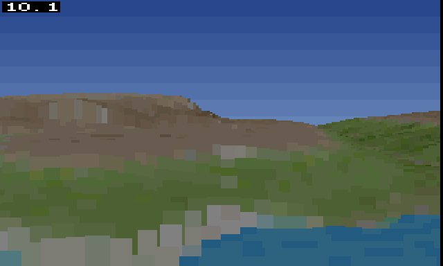

# Search and Rescue

A 1990s-style heightfield voxel flight simulator for the [MEGA65](https://mega65.org/),
written in C for the [Calypsi](https://github.com/hth313/Calypsi-tool-chains) toolchain,
with the renderer's inner loop in 45GS02 assembly.



The eventual game is a post-earthquake drone search-and-rescue simulator: low-altitude
flight over broken terrain, thermal and acoustic sensor modes, payload drops, and
aftershocks that reshape the landscape mid-flight. `vision.md` has the full design.

## Status

Early. There is a voxel engine you can fly around in, and not yet a game.

- 160x192 full-colour display, hardware-stretched to 320 pixels wide, double buffered
- 256x256 height and colour maps loaded from the boot disk
- Front-to-back ray march with a y-buffer, fixed point throughout, inner loop in assembly
- About 10 frames per second, up from 0.74 when the renderer was all C
- An FPS readout, which is as much HUD as there is so far

Getting there meant building a profiler first (`src/profile.c`, read with
`tools/profread.py`) rather than guessing. The compiler's 32-bit multiply turned out
to be 64% of the frame at 2203 cycles a go, against 85 on the hardware multiplier.
See `todo.txt` for what is next.

## Building

You will need:

- [Calypsi 6502 tools](https://github.com/hth313/Calypsi-tool-chains/releases) 5.18 or later
- [Xemu](https://github.com/lgblgblgb/xemu) for `xemu-xmega65`
- Ruby, for the bundled `diskutil.rb`
- Python with Pillow and NumPy, for the map converter

```sh
make run     # build build/sar.d81 and boot it in the emulator
make clean
```

The build produces a D81 with the game as `autoboot.c65`, which the MEGA65 ROM runs at
boot, and the converted maps alongside it as separate files.

## Controls

| Key | |
|---|---|
| `W` / `S` | forward, back |
| `A` / `D` | turn left, right |
| `R` / `F` | climb, descend |

## Layout

    src/          engine: display, DMA, resource loading, renderer, input, HUD
    tools/        convmap.py builds the map resources, profread.py reads profiles
    resources/    source height and colour maps
    vision.md     technical and gameplay design
    CLAUDE.md     memory map, display conventions, hardware notes, measurements

## Credits

The sample height and colour maps come from Sebastian Macke's
[VoxelSpace](https://s-macke.github.io/VoxelSpace/), which is also the clearest
write-up of the algorithm.

`diskutil.rb` was written by Fredrik Ramsberg.
